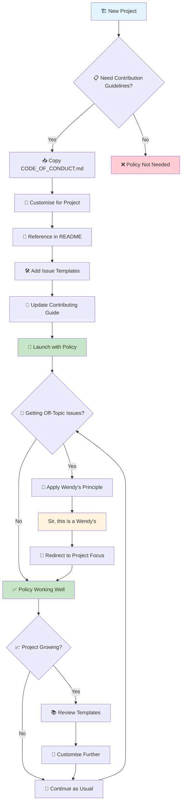

# 🚀 Policy Adoption Flow

This diagram shows the typical flow for adopting the Bounded Contribution Policy in your project.

## 📋 Quick Reference Steps

1. **🏗️ Start**: Assess if your project needs contribution guidelines
2. **📥 Copy**: Get the `CODE_OF_CONDUCT.md` file
3. **🔧 Customise**: Adapt sections for your project type
4. **📝 Reference**: Link from your README and contributing docs
5. **🛠️ Templates**: Add issue and PR templates
6. **🎉 Launch**: Start using the policy
7. **🍔 Apply**: Use "Wendy's principle" for off-topic discussions
8. **📈 Scale**: Review and enhance as your project grows

## 🎯 Success Indicators

- Fewer off-topic discussions
- Clearer contribution expectations
- Faster decision-making on contributions
- Maintained technical focus
- Reduced maintainer burnout
