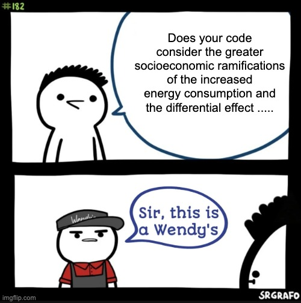

# 🤔 Frequently Asked Questions

## Table of Contents

- [💬 General Questions](#-general-questions)
- [🛠️ Implementation Questions](#️-implementation-questions)
- [🎯 Scope and Application](#-scope-and-application)
- [⚖️ Enforcement Questions](#️-enforcement-questions)
- [💼 Practical Concerns](#-practical-concerns)
- [📜 Legal and Compliance](#-legal-and-compliance)
- [🔧 Technical Implementation](#-technical-implementation)
- [🎆 Getting Help](#-getting-help)

## 💬 General Questions

### What is the Bounded Contribution Policy?

The Bounded Contribution Policy is a framework for managing project contributions that maintains technical focus
through clear scope boundaries and individual evaluation criteria.

### How does this differ from traditional codes of conduct?

Traditional codes of conduct often focus on behaviour and community standards,
while the Bounded Contribution Policy focuses specifically on contribution relevance and technical evaluation criteria.

### Who should use this policy?

This policy works well for technical projects that want to maintain focus on specific objectives,
including open source libraries, research projects, standards development, and internal technical teams.

## 🛠️ Implementation Questions

### How do I adopt this policy for my project?

1. Copy the policy document to your repository
2. Reference it in your README or contributing guidelines
3. Use the provided templates for common scenarios
4. See the [Adoption Guide](adoption/ADOPTION_GUIDE.md) for detailed steps

### Can I modify the policy for my project?

Yes, the policy is available under the MIT License for free adoption and modification.
See the [Customisation Guide](adoption/CUSTOMISATION.md) for guidance on maintaining core principles while adapting to your needs.

### Do I need special tools or platforms to use this policy?

No, the policy works with any platform or toolset.
Templates are provided for common platforms like GitHub, but the principles apply universally.

## 🎯 Scope and Application

### What counts as "technical relevance"?

Technical relevance means contributions directly support the project's stated objectives.
This includes implementation work, bug fixes, documentation improvements, testing,
and related infrastructure that advances the project.

### How do you handle edge cases or ambiguous situations?

The policy gives maintainers discretion to make decisions based on project needs.
When in doubt, maintainers can reference the core principles and make consistent decisions that support project objectives.

### Can contributors discuss project direction or requirements?

Yes, discussions about technical direction, requirements, and implementation approaches are within scope
when they directly relate to project objectives and are conducted constructively.

## ⚖️ Enforcement Questions

### How is the policy enforced?

Enforcement is straightforward: contributions and discussions that don't align with the stated principles are redirected or declined.
The policy provides clear criteria for consistent decision-making.

### What happens if someone repeatedly violates the policy?

Repeated violations may result in restricted access or removal from the project, similar to any project management approach.
The focus is on maintaining project effectiveness rather than punishment.

### How do you handle disagreements about policy application?

Maintainers have final authority on policy interpretation for their projects.
Contributors can discuss specific applications constructively, but ultimate decisions rest with project leadership.

## 💼 Practical Concerns

### Does this policy create a hostile environment?

The policy is designed to be neutral and professional, focusing on work rather than people.
It provides clear expectations that can reduce conflicts by establishing explicit boundaries.

### How does this affect project growth and community building?

Projects using this policy often see improved focus and more efficient collaboration.
Community growth occurs around shared technical interests rather than broader social engagement.

### What about onboarding new contributors?

The policy provides clear guidelines that help new contributors understand expectations.
Templates and examples make it easier for newcomers to provide appropriate contributions and feedback.

## 📜 Legal and Compliance

### Is this policy legally compliant?

The policy focuses on contribution evaluation criteria and project scope, which are standard project management practices.
It doesn't address employment law, harassment, or other legal compliance areas that may require additional policies.

### Can this policy be used alongside other organizational policies?

Yes, this policy addresses contribution management specifically and can complement broader organizational policies,
codes of conduct, or legal compliance frameworks.

### What about accessibility and inclusion considerations?

The policy's focus on individual evaluation based on technical merit supports fair assessment regardless of contributor background.
Projects may need additional accessibility guidelines for participation methods.

## 🔧 Technical Implementation

### How do I integrate this with existing project governance?

The policy can work within existing governance structures by providing clear criteria for contribution evaluation.
It complements rather than replaces broader project management approaches.

### What metrics should I track to measure policy effectiveness?

Consider tracking: time spent on non-technical discussions, contributor satisfaction with clear expectations,
decision-making consistency, and overall project focus maintenance.

### How often should the policy be reviewed or updated?

Review the policy when project scope changes significantly or if application challenges arise.
Most projects find the core principles remain stable while implementation details may need occasional adjustment.

### What if someone asks about the socioeconomic implications of my project?

Politely redirect them to the project's technical objectives. Example responses:

- "This project focuses on [technical objective]. For broader discussions, you might want to check out [appropriate forum]."
- "We keep our discussions focused on implementation details. Thanks for understanding!"
- "Let's keep our focus on the technical implementation. Thanks for understanding!"

Remember: You're not being rude by maintaining focus. You're ensuring the project stays productive and on-mission.

### What's the "Sir, this is a Wendy's" reference about?

This is a popular internet meme that humorously points out when someone is in the wrong place for a particular discussion.
In technical projects, we sometimes adapt this as a gentle way to redirect off-topic conversations.

The idea is simple: just like you wouldn't go to a fast-food restaurant to discuss philosophy, a code repository isn't the place for debates
about society or politics. It's about matching the conversation to the appropriate venue.

**When to use this principle:**

- Someone raises non-technical concerns in technical discussions
- Contributors want to debate broader societal implications instead of implementation details
- Discussions drift far from the project's technical goals

**How to use it respectfully:**

Different cultures express redirection differently. The key is being clear and kind:

- "This discussion has moved beyond our project's technical scope"
- "Let's refocus on the implementation details"
- "That's an interesting perspective, but it's outside our project's boundaries"
- And yes, sometimes: "Sir, this is a code repository" (with a smile)

The goal isn't to dismiss anyone's concerns—it's to keep technical projects productive by having the right conversations in the right places.

## 🎆 Getting Help

### Where can I get support for implementing this policy?

- Review the [Adoption Guide](adoption/ADOPTION_GUIDE.md) for step-by-step instructions
- Use provided templates for common scenarios
- Adapt examples from the [Customisation Guide](adoption/CUSTOMISATION.md)
- Contact the project maintainers for specific questions

### How can I contribute improvements to this policy?

See [CONTRIBUTING.md](CONTRIBUTING.md) for guidelines on suggesting improvements to the policy itself.
Focus on practical implementation improvements and clarification of principles.
